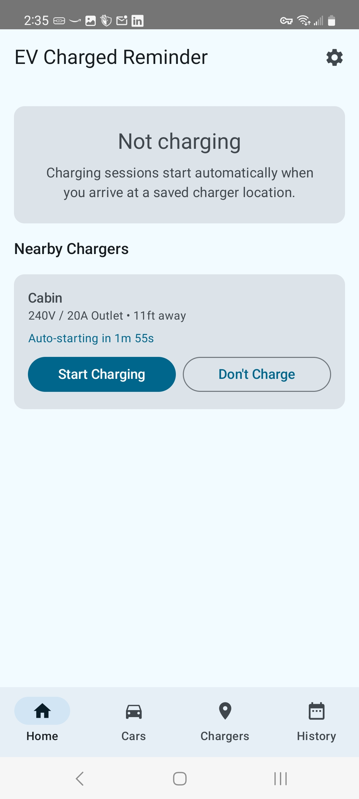
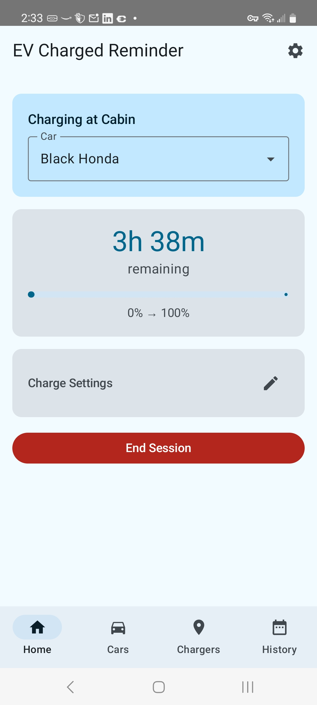
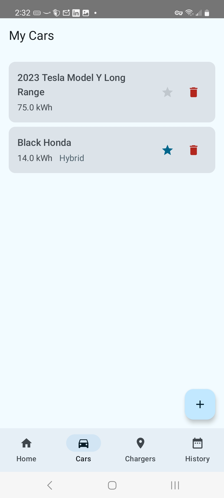
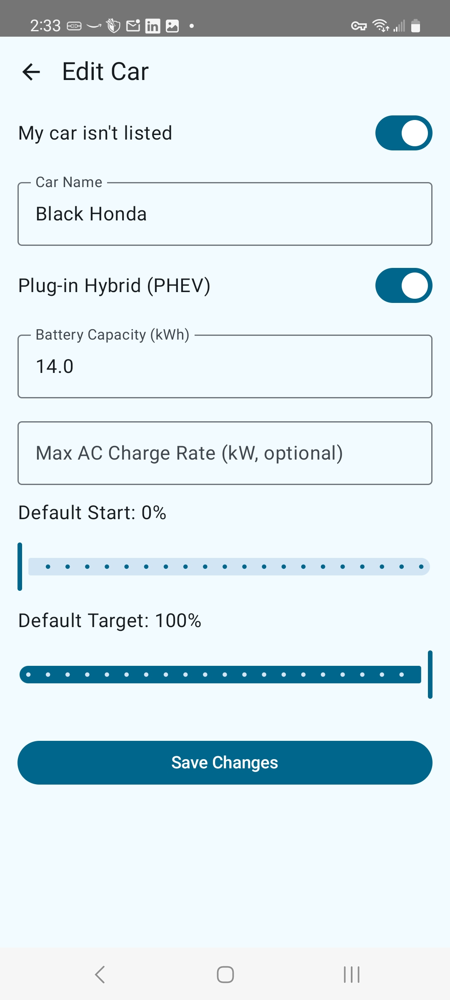
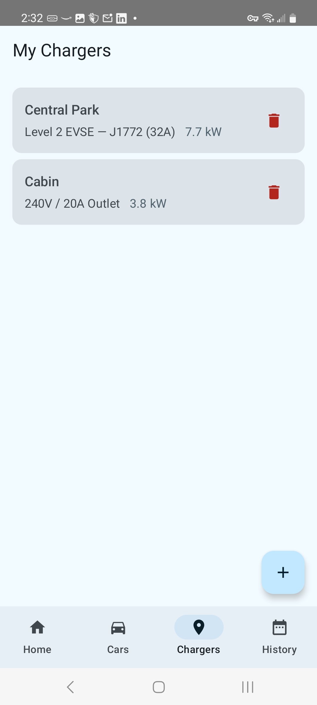
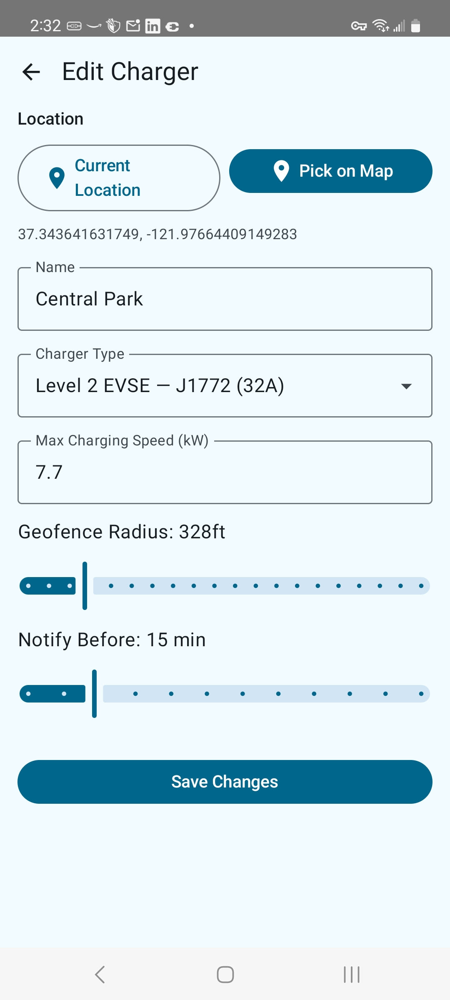
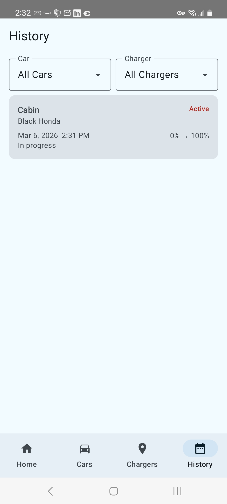

# EV Charged Reminder

A free, open-source Android app that automatically detects when you're charging your EV and notifies you when charging is estimated to be complete.

No ads. No accounts. No telemetry. All data stays on your device.

**[Download latest APK](https://github.com/heikkitoivonen/ev-charged-reminder/releases/download/latest/ev-charged-reminder.apk)**

## Screenshots

<p>







</p>

## Features

- **Automatic session detection** — The app detects when you arrive at a saved charger location and starts a charging session automatically.
- **Smart charge time estimates** — Uses realistic charging curves for both AC (Level 1/2) and DC fast charging, accounting for battery taper at high state of charge.
- **Configurable notifications** — Get alerted when charging is nearly complete so you can move your car promptly.
- **Multiple cars and chargers** — Save all your vehicles and charging locations. Set a favorite/default car for automatic session creation.
- **Charger type presets** — Built-in presets for common outlet types (with NEC 80% derating), Level 2 EVSE, and DC fast chargers. Custom power entry supported.
- **Bundled EV database** — 50+ vehicles from major manufacturers pre-loaded for quick setup.
- **Map-based charger placement** — Pick charger locations on an OpenStreetMap view with a visual geofence radius overlay.
- **Override charge settings mid-session** — Adjust start/target percentages and switch the linked car while charging.
- **Two-tier background monitoring** — Passive geofencing when idle (no battery drain), foreground service only during active sessions.
- **Privacy-first** — No cloud accounts, no sign-in, no analytics. Location data never leaves your device.

## Requirements

- Android 8.0 (API 26) or higher
- Google Play Services (for geofencing)
- Location permission (including background location for automatic detection)

## Building

```bash
# Clone the repository
git clone https://github.com/heikkitoivonen/ev-charged-reminder.git
cd ev-charged-reminder

# Run tests
./gradlew test

# Build debug APK
./gradlew assembleDebug
```

The debug APK will be at `app/build/outputs/apk/debug/app-debug.apk`.

## Tech Stack

| Layer | Choice |
|---|---|
| Language | Kotlin |
| UI | Jetpack Compose + Material Design 3 |
| Architecture | MVVM + Clean Architecture |
| Local DB | Room |
| DI | Hilt |
| Background | WorkManager + Foreground Service |
| Location | Google Play Services Fused Location + Geofencing API |
| Maps | osmdroid (OpenStreetMap) |
| Navigation | Compose Navigation (type-safe) |

## How It Works

1. **Add your car** — Select from the bundled EV database or enter details manually.
2. **Add your charger** — Use your current location or pick a spot on the map. Set the charger type and geofence radius.
3. **Just drive** — When you park near a saved charger, a charging session starts automatically with a progress notification.
4. **Get notified** — The app estimates when charging will finish and alerts you before it's done.
5. **Session ends automatically** — When the charging target is reached, or when you leave and return to the charger (e.g., to unplug). You can also end a session manually.

## Privacy

See [Privacy Policy](PRIVACY_POLICY.md). In short: no data is collected, transmitted, or shared. Everything stays on your device.

## License

[MIT License](LICENSE.txt) — Copyright 2026 Heikki Toivonen
